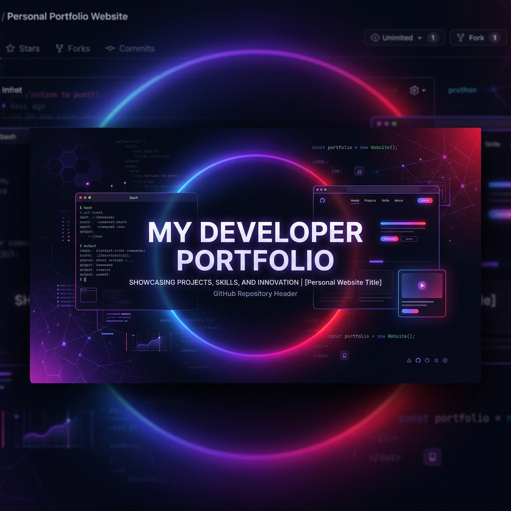
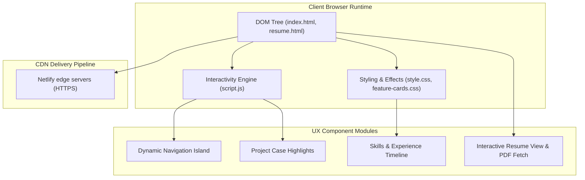

# 🎨 Personal Portfolio Website

[](https://developer.mozilla.org/en-US/docs/Web/HTML)
[](https://developer.mozilla.org/en-US/docs/Web/CSS)
[](https://developer.mozilla.org/en-US/docs/Web/JavaScript)
[](https://www.netlify.com/)
[](https://opensource.org/licenses/MIT)

A professional, modern, and fully responsive personal portfolio website designed to showcase developer skills, GitHub projects, and career progression. This project demonstrates highly customized styling, user-centric UX/UI flow, glassmorphic layout components, and performance-optimized static asset loadouts.

---

<p align="center">
  
</p>

---

## 🗺️ Navigation Index

1. [🔗 Live Demo](#-live-demo)
2. [✨ Core Features](#-core-features)
3. [🏗️ Client-Side Architecture](#%EF%B8%8F-client-side-architecture)
4. [🖥️ Folder Structure](#%EF%B8%8F-folder-structure)
5. [⚙️ How to Setup & Run Locally](#%EF%B8%8F-how-to-setup--run-locally)
6. [📬 Contact & Socials](#-contact)

---

## 🔗 Live Demo

Visit the interactive site live:  
👉 **[muhammadasadpportfolio.netlify.app](https://muhammadasadpportfolio.netlify.app/)**

---

## ✨ Core Features

- **📱 Fully Responsive Layout:** Pixels scale fluidly across desktop, tablet, and mobile displays using raw CSS flexbox/grid.
- **🏝️ Dynamic Island Navigation:** A smooth header bar utilizing CSS transitions for an interactive navigation aesthetic.
- **📂 Git Project Showcase:** Highlight cards showing active repositories and key project statistics.
- **📈 Visual Timeline:** An interactive timeline card mapping career highlights and skills.
- **📄 Resume Integration:** Separate clean viewer page (`resume.html`) with options to instantly download a professional PDF copy.
- **⚡ Micro-Animations:** Lightweight hover transitions, parallax card depths, and smooth-scrolling event listener intercepts.

---

## 🏗️ Client-Side Architecture

The architecture is purely static to maximize CDN delivery speed and performance:



---

## 🖥️ Folder Structure

```text
/
├── index.html            # Main site hub & developer summary
├── resume.html           # Dedicated professional resume reader view
├── style.css             # Root design tokens, variables, & main grid styles
├── feature-cards.css     # CSS rules for specialized visual cards
├── script.js             # Event listeners, active classes, & navigation logic
├── assets/               # Branding assets
│   └── banner.png        # Glowing tech banner
├── images/               # Project screenshots & decorative SVGs
├── profile.jpg           # Header avatar image
└── resume.pdf            # Printable PDF resume asset
```

---

## ⚙️ How to Setup & Run Locally

Since this is a lightweight static site, no external bundlers, package managers, or server frameworks are necessary.

### Running Options

#### Option A: Direct Execution
1. Clone the repository:
   ```bash
   git clone https://github.com/asad594/My-Portfolio.git
   cd My-Portfolio
   ```
2. Simply double-click `index.html` or open it directly inside any browser.

#### Option B: Local Web Server (Recommended)
To prevent CORS conflicts on AJAX modules or custom layouts, run a lightweight server:
- **Using Python 3:**
  ```bash
  python -m http.server 8000
  ```
  Open your browser and navigate to: [http://localhost:8000](http://localhost:8000)

- **Using Node.js (`live-server`):**
  ```bash
  npx live-server
  ```

---

## 📬 Contact

I am always open to new opportunities, collaborations, and conversations. Connect with me!

- **🌐 Live Site:** [muhammadasadpportfolio.netlify.app](https://muhammadasadpportfolio.netlify.app)
- **📧 Email:** [asad.spartan300@gmail.com](mailto:asad.spartan300@gmail.com)
- **💼 LinkedIn:** [linkedin.com/in/muhammadasad-arshad](https://www.linkedin.com/in/muhammadasad-arshad/)
- **🐙 GitHub:** [github.com/asad594](https://github.com/asad594)

---

⭐ *Found this template helpful? Give the repository a star!*
